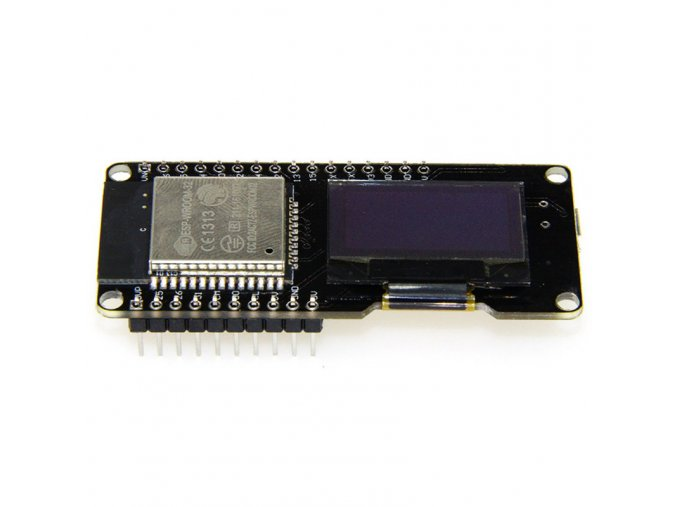
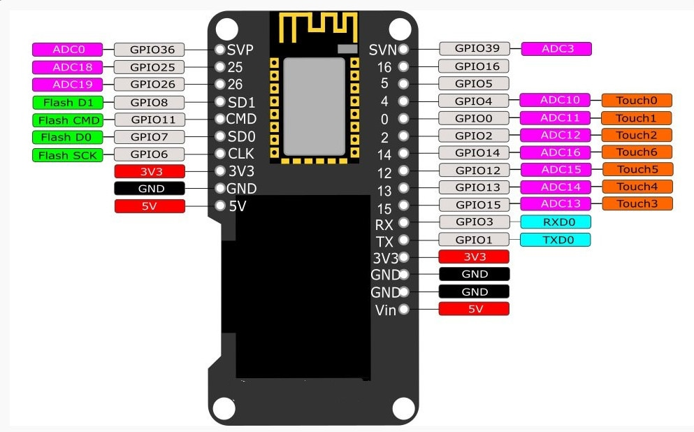
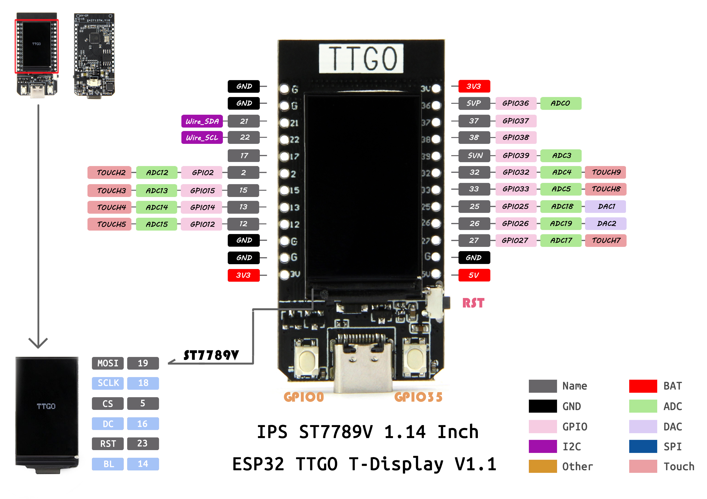

# ESP32-BTC
Simple Demo for an ESP32 module with a TFT LCD or an OLED display.

Displays current time and BTC price in USD.

Supports two different modules directly:

- ESP32 with I2C connected SSD1306 driven OLED display (resolution 128x64) made by Lolin as [WEMOS LOLIN32]( https://github.com/FablabTorino/AUG-Torino/wiki/Wemos-Lolin-board-(ESP32-with-128x64-SSD1306-I2C-OLED-display))
- ESP32 with SPI connected ST7789V driven TFT LCD display (resolution 240x135) made by TTGO as [T-Display](https://github.com/Xinyuan-LilyGO/TTGO-T-Display)

It's very easy to modify the source code for any I2C or SPI connected display.

The demo application shows several useful techniques, such as:
- using a single source code with very different displays and graphics libraries
- obtaining current time using SNTP
- obtaining current bitcoin price using a web API
- avoiding JSON library when decoding simple JSON message
- using the Tasker library to call a task periodically or on a button press

To install ESP32 core on Arduino follow the instructions on this page:
https://github.com/espressif/arduino-esp32#installation-instructions

Then you'll need to install either SSD1306 or TFT_eSPI libraries and also NTPClient and Tasker libraries. They are available via the Arduino Library Manager.

Configuring the TFT_eSPI for use with the TTGO T-Display is kinda tricky currently (it'll need a specific driver for the weird resolution and screen start offset, eventually) but it's explained at the T-Display web linked above.

Enjoy!

Petr Stehlik
https://github.com/joysfera

#### LOLIN32 photo

#### LOLIN32 pinout

#### TTGO T-Display

